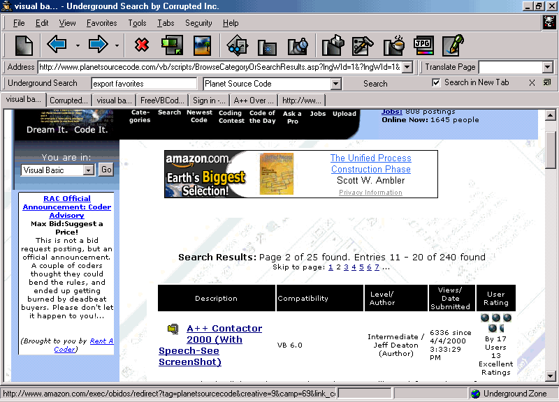



## Underground Browser Beta 5\(Source Code\)

### Description

The best browser on planet source code's Site, with all the

features of the major browser plus more. Including Popup Killing.

Features of The Underground Browser

- The Colors are messed up in the screen shot, but the Browser is really

Cool.

- For all you haters out there who Pulled down my little teaser, here  it

is the real thing. Let Me just here what yall are saying now.

- Best Browser on PSC

- All the features of the other browsers

- plus more.....

- Favorites in Menu

- Full Screen Mode (Hype)

- Removable Toolbar items or bands

- Search Toolbar (like Google Toolbar)

- Custamizable Searches (Add your own Engine)

- Translation from Main screen

- Custamizable Translation url (Can Add your own, Google or Altavista)

- Two ways to Kill Popups

- The one that every body uses on PSC (Which kills your open new window

calls)

- The One written by ME to Kill popups fast and safe (will be suprized  as

to how it works)

- Popup Killa does not use scarce resources running a timer, checking

every open window for a popup. Slowing down your computer this works and you

dont even know it was there.

- Easy to use Menus

- Easy to use options

- Features on the main screen

- Browsing options available on demand without digging through options (Java

scripting and media Options)

- Read the Credits for shoutouts and thanxs

- I bet most of you are wondering why I released the source, but its

because this is a Browser Built from Planet Source Code. So it is  only

fitting that it ends up here.
 
### More Info
 

             |
---                |---
**Submitted On**   |2001-06-30 21:13:56
**By**             |[Spaz](https://github.com/Planet-Source-Code/PSCIndex/blob/master/ByAuthor/spaz.md)
**Level**          |Intermediate
**User Rating**    |3.5 (42 globes from 12 users)
**Compatibility**  |VB 6\.0
**Category**       |[Complete Applications](https://github.com/Planet-Source-Code/PSCIndex/blob/master/ByCategory/complete-applications__1-27.md)
**World**          |[Visual Basic](https://github.com/Planet-Source-Code/PSCIndex/blob/master/ByWorld/visual-basic.md)
**Archive File**   |[Undergroun22104722001\.zip](https://github.com/Planet-Source-Code/spaz-underground-browser-beta-5-source-code__1-24664/archive/master.zip)

